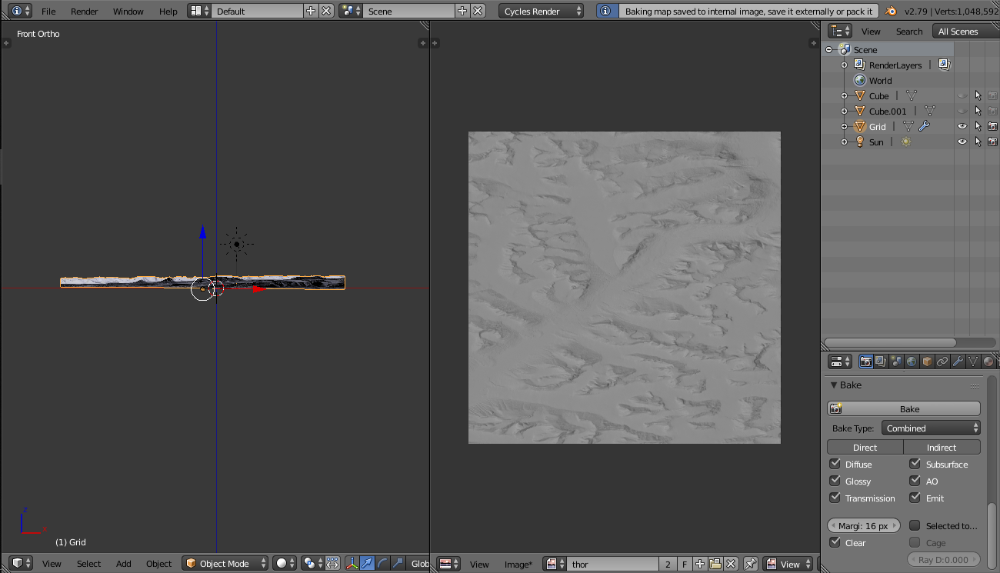

# ARKit-Stereoscope-CDEM (under construction)
Explore Canadian Digital Elevation Model with Blender, Gimp, and ARKit.

This project shows how to use Blender to make 3D meshes of GeoTIF files from the Government of Canada:

https://open.canada.ca/data/en/dataset/7f245e4d-76c2-4caa-951a-45d1d2051333

(This tutorial assumes users are familiar with Blender (www.blender.org, youtube, books) and shows some steps to make textured 3D mesh from GeoTIF.)

# Hardware

Tested on Apple 2018 9.7" iPad (A9 CPU or higher for ARKit).

The OWL Stereoscopic Viewer(£15.00) from [The London Stereoscopic Company Ltd](https://www.londonstereo.com/)

https://github.com/Physicslibrary/ARKit-Stereoscope-67P explains how to use the stereoscope with a 9.7" iPad.

# Software

GIMP 2.10.8 (https://www.gimp.org/) 
Blender 2.79b (https://www.blender.org/)

Apple Swift Playgrounds 3.0 from iOS App Store. Swift Playgrounds lets kids ages ~4 and Up program their iPad directly to experiment with ARKit and Scenekit.

Go to https://github.com/Physicslibrary/ARKit-Stereoscope-Hipparcos for more info on "Enable Results".

# GeoTIF to 3D mesh

On the Government of Canada's webpage, select https://maps.canada.ca/czs/index-en.html to access "Geospatial-Data Extraction tool".

We will be using Thor Peak located in Auyuittuq National Park, Nunavut as an example. The mountain has a vertical drop of 1250m (google "thor peak" or "mount thor" to see images, especially images with people near the mountain to get a sense of scale).

1. Type "thor peak" for a location:

2. Zoom out until the Map Scale is 5km:

3. Visualize CDEM:

4. Select "Current Map Extent":

Measure the dimensions of the map. In this case, 46.4km horizontal and 37.2km vertical (no built in tools, used a real ruler). 
The dimensions of the polygon coordinates may be useful for computing the dimensions of the map instead (the first four pairs of number are coordinates of the rectangle starting from the bottom left, going counterclockwise, the last pair of number is the same as the first).

Enter email address to get a zipped file. Unzip file, get folders and DEM.tif. DEM.tif will be used to displace a grid mesh in Blender. However, Blender 2.79b quits when reading DEM.tif as a texture.

DEM.tif looks fine in GIMP.

Hard to see, navigate to "Colors", "Levels...", and "Auto Input Levels".

Cancel "Levels". GIMP can also display metadata. Select "Image", "Metadata", and "View Metadata".

Close (metadata may be useful in the future).

Select "File", "Export as...", and new file as DEM2.tif.

Open Blender, on the top, set to "Cycles Render", on the right, set Units to "Kilometers", Length to "Metric", and Unit Scale to 1000. Add a grid and subdivide to 1024.

On the right, select Texture and open DEM2.tif and set "Image Mapping Extensions: Extend".

Add Modifier Displace.

Browse and select texture loaded earlier.

In Modifier Displace, set Midlevel to 0, dimensions X = 46.4km, Y = 37.2km, Z = 1km, and "View Clip: Start: 1m End: 100km".

Grey height map is hard to read so get a reference.

https://open.canada.ca/data/en/dataset/7f245e4d-76c2-4caa-951a-45d1d2051333

Press "View on Map" to get the Open Maps Data Viewer. Hide CDEM layer. Look for "thor peak".

Thor Peak is ~1640m and Weasel River is ~120m.

In Blender, add a mesh cube of dimensions 4km x 10m x 1520m and adjust Grid's Z dimension until it is about the same as the height as Cube.

Before.

After.

Add a sun lamp to the scene and preview.

Use shift-f in Blender to fly (WASD with mouse, mouse scroll wheel to change speed) around the mountain.

https://docs.blender.org/manual/en/latest/editors/3dview/navigate/walk_fly.html

Can stop here without going further as Blender can be used to view the mountain. The 3D grid can be exported to an .obj file for use in other programs such as iOS Swift Playgrounds, Unity, or Unreal. However, the exported file will be ~100MB which will not work for mobile app Swift Playgrounds.

Next is generate a texture map (from a high-poly mesh) and decimate/export the high-poly mesh to a low-poly mesh.

Orient the mountain so the user is at a certain position facing a certain direction (on a river facing Thor Peak). One way to do this is add Cube.001 at (0,0,0) and then adjust Grid until Cube.001 is at a specific position and orientation (direction of Cube.001 green arrow).

(warning - in Playgrounds, the position is correct but orientation is not, probably need to know how Blender export objects and how Scenekit read them)

Create a new view to "UV/Image Editor" and make a new 2048x2048 image called thor.

Select the Grid and enter "Edit Mode".

"UV Unwrap", "Project from View", and back to "Object Mode".

Switch a view to "Node Editor", add a new material, add a new image texture, and set image texture to thor.

Bake image texture of selected object.

Save texture as thor.png.

Next is to reduce size of Grid ~1M vertices. On the right, select "Modifiers" and "Decimate".

Change Ratio from 1.0 to 0.1. The result will be Grid ~100k vertices.

Export to thor.obj.

# Credits

thor.obj and thor.png were created from GeoTIFF files generated from:

https://maps.canada.ca/czs/index-en.html

https://www.canada.ca/en/transparency/terms.html

# References

https://en.wikipedia.org/wiki/GeoTIFF

https://en.wikipedia.org/wiki/Mount_Thor

https://johnflower.org/tutorial/make-mountains-blender-heightmaps

Thank to John for creating an excellent tutorial.

Youtube on Blender.

https://www.youtube.com/watch?v=sB09T--_ZvU

https://www.youtube.com/watch?v=0r-cGjVKvGw

 
Copyright (c) 2019 Hartwell Fong

